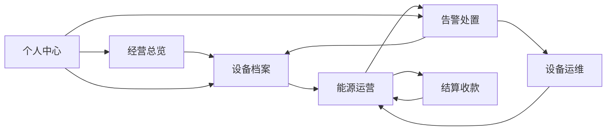

# 智园能管前端业务闭环设计（Web）

这份文档按菜单和页面讲前端怎么串业务，不按表单讲。

## 页面组织原则

- 父模块是一个业务域
- 子页面是业务链中的一个环节
- 页面之间要能互相跳转并携带筛选条件
- 列表只是入口，详情和侧边工作区才是主操作区

## 总体链路

## 1. 经营总览

### 子页面

- 经营总览

### 前端职责

- 组织/园区切换
- 指标卡片
- 运行拓扑
- 快捷入口
- 经营趋势图

### 联动目标

- 卡片点击跳到对应模块
- 组织切换联动设备、告警、账单、能耗
- 总览数字和后续页面筛选条件保持一致

### 页面建议

- 顶部只保留当前组织选择、刷新和必要状态
- 指标卡片点击后跳转到具体页面并带过滤参数
- 总览侧边快捷入口按权限显示

## 2. 设备档案

### 子页面

- 组织档案树
- 设备档案

### 组织档案树前端职责

- 左侧树状展示组织、网关、设备层级
- 默认展示顶层组织，逐级展开
- 节点操作根据选中对象动态变化
- 右侧工作区跟随选中节点刷新
- 节点上支持跳转到实时、历史、告警、指令、账单

### 设备档案前端职责

- 卡片展示设备列表
- 详情页分区展示基础信息、实时数据、历史数据、告警数据、指令记录
- 详情页右侧内容要能根据设备类型动态变化
- 从详情直接跳到监控、告警、运维、结算

### 联动目标

- 树节点是所有页面的统一筛选入口
- 设备档案页是其他业务页的默认钻取目标

## 3. 能源运营

### 子页面

- 实时监控工作台
- 历史数据分析
- 能耗统计与数据质量

### 实时监控前端职责

- 设备和测点选择
- 实时曲线和状态卡
- 显示离线、故障、异常
- 从实时点跳设备详情或告警

### 历史数据分析前端职责

- 时间范围、设备、测点选择
- 图表和表格切换
- 支持多测点趋势
- 异常区间可视化

### 数据质量前端职责

- 完整率、缺失率、重算结果展示
- 质量风险列表
- 点击风险项跳到历史、设备、告警

### 联动目标

- 实时异常 -> 告警
- 历史异常 -> 数据质量
- 质量低 -> 结算预警

## 4. 告警处置

### 子页面

- 告警事件中心
- 告警处置台

### 告警事件中心前端职责

- 展示所有告警事件
- 告警等级、类型、组织、设备筛选
- 告警统计卡片
- 事件详情里展示设备历史和实时信息

### 告警处置台前端职责

- 默认待处理告警
- 处置、关闭、误报、忽略
- 处置时可直接下发指令

### 联动目标

- 告警事件 -> 设备详情
- 告警事件 -> 指令追踪
- 告警处置结果 -> 个人中心和审计

## 5. 结算收款

### 子页面

- 结算工作台
- 账单中心

### 结算工作台前端职责

- 配置选择
- 规则完整性检查
- 账单预览
- 风险提示

### 账单中心前端职责

- 账单生命周期操作
- 账单明细和快照查看
- 从账单跳回设备和历史数据

### 联动目标

- 数据质量决定能否结算
- 告警异常可影响账单提示
- 账单详情反查用能证据

## 6. 设备运维

### 子页面

- 接入诊断
- 设备控制台
- 指令追踪

### 接入诊断前端职责

- 网关在线状态
- 原始报文
- 解析结果

### 设备控制台前端职责

- 指令模板
- 指令下发
- 下发后自动进入追踪

### 指令追踪前端职责

- 执行状态
- 回执详情
- 失败原因

### 联动目标

- 运维异常 -> 告警
- 指令成功 -> 刷新设备实时数据
- 指令失败 -> 记录审计

## 7. 个人中心

### 子页面

- 个人中心

### 前端职责

- 我的组织范围
- 我的角色权限
- 我的待办
- 我的操作记录

### 联动目标

- 个人中心是进入系统后个人工作视角的汇总页
- 所有业务页都可从这里反查用户可见范围和最近动作

## 页面跳转建议

- 总览卡片 -> 具体业务页
- 设备详情 -> 能源运营、告警、运维、结算
- 告警详情 -> 设备详情、指令追踪
- 账单详情 -> 历史分析、设备详情
- 指令记录 -> 设备详情、实时监控

## 前端组件建议

- 统一筛选条：组织、设备、时间、状态
- 统一表格容器：可滚动、固定表头、无外露滚动条
- 统一详情页：左详情右列表或图表
- 统一图表区：ECharts
- 统一联动跳转：携带 query 参数

## 实施顺序建议

1. 设备档案先做成业务中枢
2. 能源运营补齐数据质量
3. 告警处置改成事件台
4. 结算收款串起证据链
5. 运维页和个人中心做联动收口

